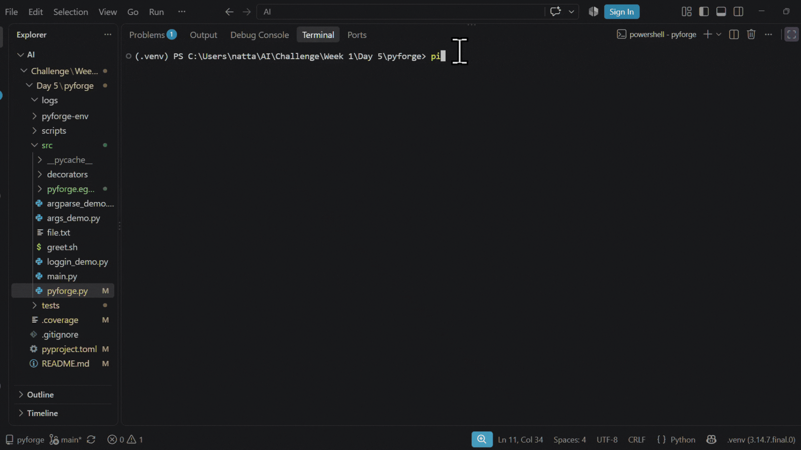

# PyForge

A Python developer productivity CLI built as part of my 10-Week Challenge.

PyForge currently provides five CLI commands:

* `analyze` — Analyze a Python file
* `clean` — Clean a Python file
* `stats` — Show file statistics
* `config` — Show PyForge configuration
* `version` — Show the current version

## Setup

Clone the repository and create a virtual environment:

```bash
git clone https://github.com/nattar-kani/Day5-Week1-10WeeksChallenge
cd pyforge

python -m venv pyforge-env
```

Activate the environment.

**Windows PowerShell:**

```powershell
.\pyforge-env\Scripts\Activate.ps1
```

Install PyForge in editable mode:

```powershell
pip install -e .
```

## Usage

Show available commands:

```powershell
pyforge --help
```

Check the version:

```powershell
pyforge version
```

Analyze a file:

```powershell
pyforge analyze test.py
```

Run with verbose output:

```powershell
pyforge analyze test.py --verbose
```

Show statistics:

```powershell
pyforge stats test.py
```

Clean a file:

```powershell
pyforge clean test.py
```

View configuration:

```powershell
pyforge config
```

## Testing

Run the test suite:

```powershell
pytest
```

Run tests with coverage:

```powershell
pytest --cov
```

The project maintains more than 70% test coverage.

## Usage Demo



## What I Practiced

This project helped me practice:

* Python CLI development with `argparse`
* Subcommands and command-line arguments
* Logging
* Python decorators
* `pytest` and parameterized testing
* Test coverage
* Python packaging with `pyproject.toml`
* Editable package installation with `pip install -e .`
* Building a CLI that can be executed directly from the terminal


